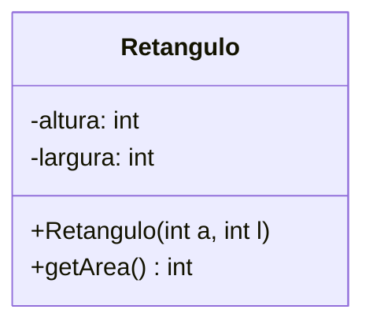
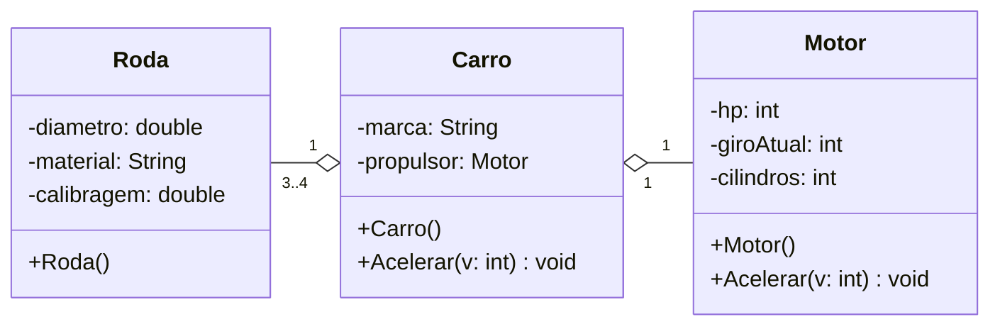
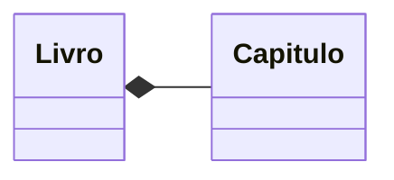
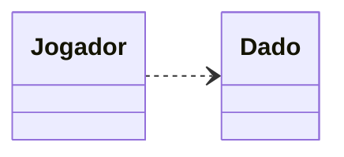
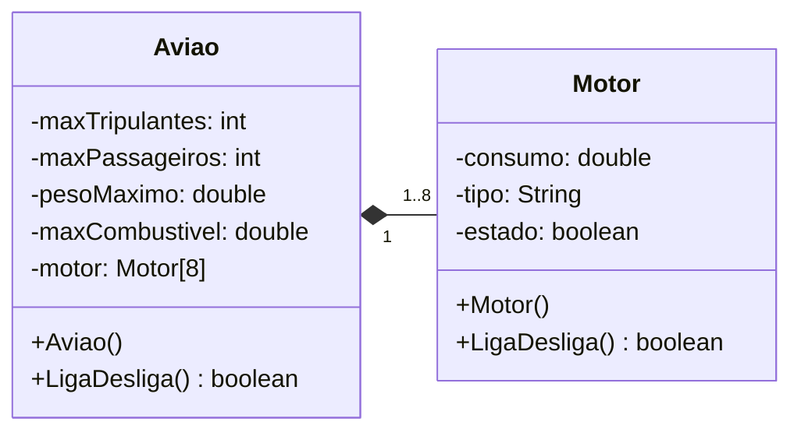
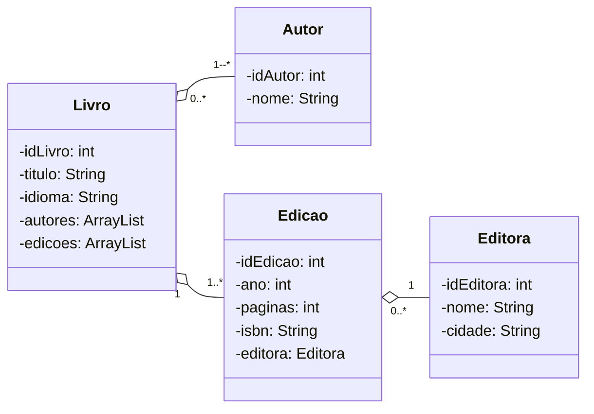

```mermaid
classDiagram
    direction LR

    class Retangulo{
        -altura: int
        -largura: int
        +Retangulo(int a, int l)
        +getArea() int
    }
```

```mermaid
classDiagram
    direction LR
    Carro "1" o-- "1" Motor
    Roda "3..4" --o "1" Carro

    class Carro{
        -marca: String
        -propulsor: Motor
        +Carro()
        +Acelerar(v: int) void
    }
    
    class Motor {
        -hp: int
        -giroAtual: int
        -cilindros: int
        +Motor()
        +Acelerar(v: int) void
    }
    
    class Roda {
        -diametro: double
        -material: String
        -calibragem: double
        +Roda()
    }
```

```mermaid
classDiagram
    direction LR
    Livro *-- Capitulo
    
    class Livro {
        
    }
    
    class Capitulo {
        
    }
```

```mermaid
classDiagram
    direction LR
    Jogador ..> Dado
    
    class Jogador {
        
    }
    
    class Dado {
        
    }
```

```mermaid
classDiagram
    direction LR
    Aviao "1" *-- "1..8" Motor
    
    class Aviao {
        -maxTripulantes: int
        -maxPassageiros: int
        -pesoMaximo: double
        -maxCombustivel: double
        -motor: Motor[8]
        +Aviao()       
        +LigaDesliga() boolean
    }
    
    class Motor {
        -consumo: double
        -tipo: String
        -estado: boolean
        +Motor()
        +LigaDesliga() boolean
    }
```

```mermaid
classDiagram
    direction LR
    
    Livro "0..*" o-- "1--*" Autor
    Livro "1" o-- "1..*" Edicao
    Edicao "0..*" o-- "1" Editora
    
    class Livro {
    -idLivro: int
    -titulo: String
    -idioma: String
    -autores: ArrayList<Autor>
    -edicoes: ArrayList<Edicao>
    }
    
    class Edicao {
        -idEdicao: int
        -ano: int
        -paginas: int
        -isbn: String
        -editora: Editora
    }
    
    class Editora {
        -idEditora: int
        -nome: String
        -cidade: String
    }
    
    class Autor {
        -idAutor: int
        -nome: String
    }
```

