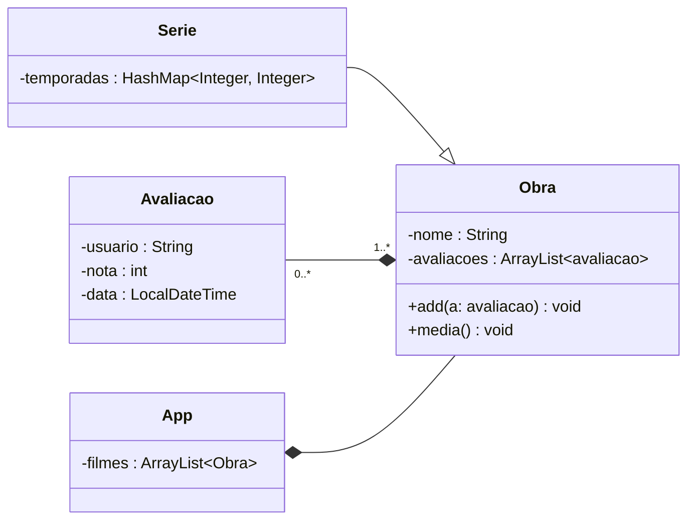

```mermaid
classDiagram
    direction LR
    Serie --|> Obra
    Avaliacao "0..*" --* "1..*" Obra
    App *-- Obra
    
    
    class Obra {
        -nome : String
        -avaliacoes : ArrayList~avaliacao~
        +add(a: avaliacao) void
        +media() void
    }
    
    class Serie {
        -temporadas : HashMap~Integer, Integer~
    }
    
    class Avaliacao {
        -usuario : String
        -nota : int
        -data : LocalDateTime
    }
    
    class App {
        -filmes : ArrayList~Obra~
    }
```