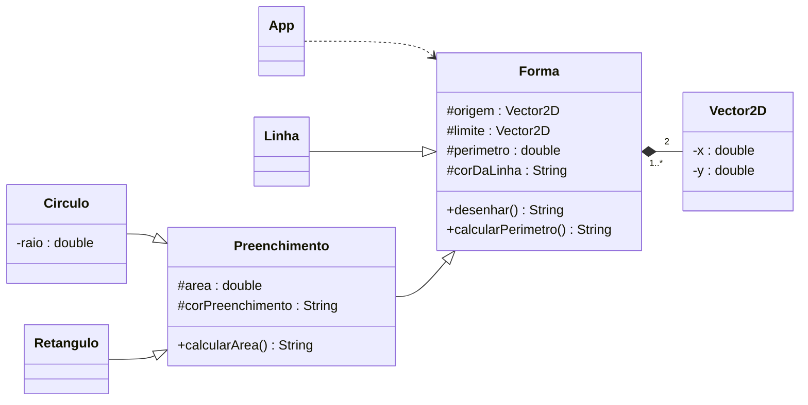

```mermaid
classDiagram
    direction LR
    App ..> Forma
    Forma "1..*" *-- "2" Vector2D
    Linha --|> Forma
    Preenchimento --|> Forma
    Circulo --|> Preenchimento
    Retangulo --|> Preenchimento
    
    class App{
        
    }
    
    class Vector2D{
        -x : double
        -y : double
    }
    
    class Forma{
        #origem : Vector2D
        #limite : Vector2D
        #perimetro : double
        #corDaLinha : String
        +desenhar() String
        +calcularPerimetro() String
    }
    
    class Linha{
        
    }
    
    class Preenchimento{
        #area : double
        #corPreenchimento : String
        +calcularArea() String
    }
    
    class Circulo{
        -raio : double
    }
    
    class Retangulo{

    }    
```