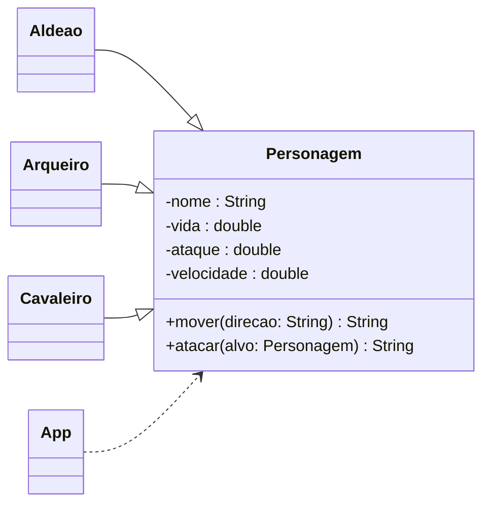

```mermaid
classDiagram
    direction LR
    Aldeao --|> Personagem
    Arqueiro  --|> Personagem
    Cavaleiro  --|> Personagem
    App ..> Personagem
    
    class App{
        
    }
    
    class Personagem{
        -nome : String
        -vida : double
        -ataque : double
        -velocidade : double
        +mover(direcao: String) String
        +atacar(alvo: Personagem) String
    }
    
    class Aldeao{

    }
    
    class Arqueiro{

    }
    
    class Cavaleiro{

    }
```