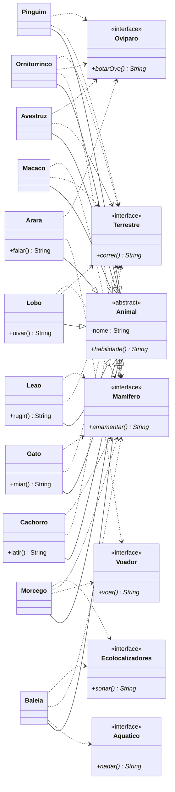

```mermaid
classDiagram
    direction LR
    Arara --|> Animal
    Avestruz --|> Animal
    Baleia --|> Animal
    Cachorro --|> Animal
    Gato --|> Animal
    Leao --|> Animal
    Lobo --|> Animal
    Macaco --|> Animal
    Morcego --|> Animal
    Pinguim --|> Animal
    Ornitorrinco --|> Animal
    Arara ..> Voador
    Arara ..> Oviparo
    Avestruz ..> Terrestre
    Avestruz ..> Oviparo
    Baleia ..> Aquatico
    Baleia ..> Mamifero
    Baleia ..> Ecolocalizadores
    Cachorro ..> Terrestre
    Cachorro ..> Mamifero
    Gato ..> Terrestre
    Gato ..> Mamifero
    Leao ..> Terrestre
    Leao ..> Mamifero
    Lobo ..> Terrestre
    Lobo ..> Mamifero
    Macaco ..> Terrestre
    Macaco ..> Mamifero
    Morcego ..> Voador
    Morcego ..> Mamifero
    Morcego ..> Ecolocalizadores
    Pinguim ..> Terrestre
    Pinguim ..> Oviparo
    Ornitorrinco ..> Mamifero
    Ornitorrinco ..> Oviparo
    Ornitorrinco ..> Terrestre
    
    
    class Animal{
        <<abstract>>
        -nome : String
        +habilidade() String*
    }
    
    class Terrestre{
        <<interface>>
        +correr() String*
    }
    
    class Voador{
        <<interface>>
        +voar() String*
    }
    
    class Aquatico{
        <<interface>>
        +nadar() String*
 }
    
    class Mamifero{
        <<interface>>
        +amamentar() String*
    }
    
    class Oviparo{
        <<interface>>
        +botarOvo() String*
    }
    
    class Ecolocalizadores{
        <<interface>>
        +sonar() String*
    }
    
    class Arara{
        +falar() String
    }
    
    class Avestruz{
        
    }
    
    class Baleia{
        
    }
    
    class Cachorro{
        +latir() String
    }
    
    class Gato{
        +miar() String
    }
    
    class Leao{
        +rugir() String
    }
    
    class Lobo{
        +uivar() String
    }
    
    class Macaco{
        
    }
    
    class Morcego{
        
    }
    
    class Pinguim{
        
    }
    
    class Ornitorrinco{
        
    }    
```